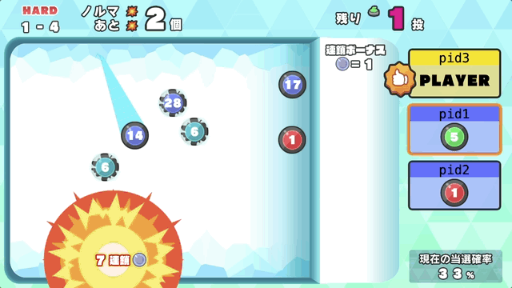

# ぶっこわしカーリング

これは「ストーン」と呼ばれる石を投げて、ぶつけて、破壊するゲームです。みんなで協力してノルマクリアを目指しましょう。



## ビルド方法

```sh
npm install # 最初に一度だけ
npm run build
```

## 実行方法

```sh
npm run serve # ブラウザで http://localhost:3300 を開く
```

## ゲーム設定

`assets/config.json` を編集することでゲームに関する設定を変更することができます。設定項目の詳細は `Configuration.ts` を参照ください。

## ライセンス

本リポジトリは MIT License の元で公開されています。 詳しくは [LICENSE](./LICENSE) をご覧ください。

ただし、画像ファイルおよび音声ファイルは CC BY 2.1 JP の元で公開されています。
